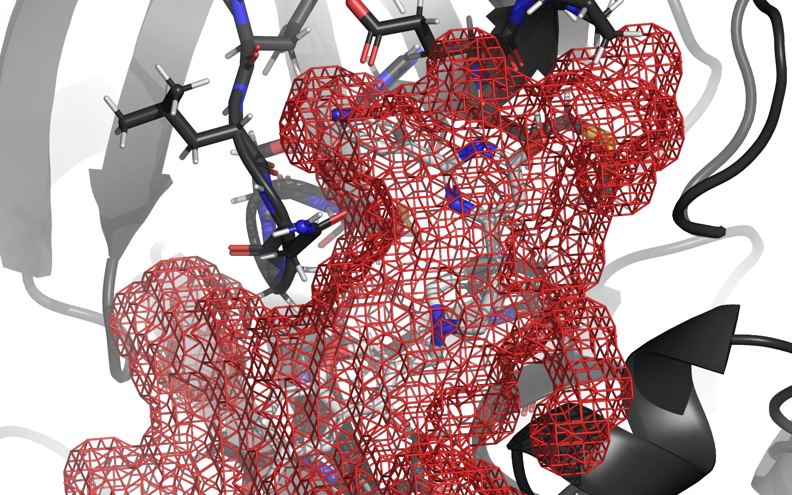

---
hide:
    - navigation
---

# Research

> RxTx Research is advancing open-source scientific software for biochemical and pharmaceutical applications.

## Motivation

RxTx Research wants to use the latest computational biochemical and biophysical scientific findings to develop the next-generation open-source scientific software for academic and industrial usage.

### Modern drug discovery funnel

Developing a new drug from an idea to a successful product is a complex process that can take up to 20 years and cost more than €1 billion. The early drug discovery and development process is a massive search function for remedies that demonstrate desirable changes in a biological system with minimum negative impact. It is a highly imperfect science, yet crucial for guiding the early concept of a biologically active molecule to a marketed pharmaceutical product.

Modern pharmaceutical companies are measured by the size of the compound libraries they use in their daily work. These millions of compounds are initially screened *in silico* to generate hundreds or thousands of hits. Hits are optimized into promising lead compounds, leads are screened *in vitro* and *ex vivo* to optimize properties, followed by the ultimate step of the clinical trials. This process is known as a Drug Discovery Funnel.

The attrition of this process is astronomical, where hundreds of thousands or millions of compounds generate one clinical trial drug candidate. These candidates fail during clinical trials more often than not, mostly due to poor translational research models and inappropriate *in vivo* disease models.

### High-throughput virtual screening in drug discovery

Structure-based drug discovery (SBDD) is becoming an essential tool in assisting fast and cost-efficient lead discovery and optimization. SBDD is nowadays central to the efficient development of therapeutic agents and the understanding of metabolic processes. SBDD is proven to be more efficient than the traditional way of drug discovery since it aims to understand the molecular basis of disease and utilizes the knowledge of the three-dimensional (3D) structure of the biological target in the process.

State-of-the-art structure-based drug design methods include (high-throughput, virtual) screening and *de novo* drug design; these serve as an efficient, alternative approach to high-throughput screening.  In the *de novo* drug design approach, the 3D structure of the receptor is used to design structurally novel molecules that have never been synthesized before using ligand-growing programs and the intuition of the medicinal chemist.

Virtual screening is a computational technique used in drug discovery to search libraries of small molecules to identify those structures which are most likely to bind to a drug target, typically a protein receptor or enzyme. In virtual screening, large libraries of drug-like compounds that are commercially available are computationally screened against targets of known structure, and those that are predicted to bind well are experimentally tested.

High-throughput virtual screening (HTVS) is a virtual screening technique where search libraries count from a few thousand to a few million compounds, screened against one or more targets. It requires a powerful computational engine to perform screening in a time-efficient manner, as well as extensive pre-processing and post-processing tools.

### Computational chemistry landscape

Bioinformatics (computational informatics) is an interdisciplinary field that develops methods and software tools for understanding biological data. It is a field that was born during a [Human Genome Project](https://www.genome.gov/) in the last decade of the 20th century, and it is a field that revolutionized almost every aspect of biomedical science and gave birth to many fields within molecular biology and modern biochemistry.

The main reason for this biomedical Renaissance is the fact that every core aspect of computational biology was open source, every part of the code and algorithms was standardized, and any research group in the world – from scientific giants in the USA to start-ups in Asia or Africa – could contribute to the scientific field, freely collaborate and grow exponentially and without any legal barrier.

Unlike bioinformatics, computational chemistry did not take that path.

The history of the computational chemistry software toolbox is mired with proprietary software and a high-cost entry barrier to anyone starting their medicinal chemistry training, setting up a modern drug discovery laboratory in academia, or financing their research as a fledgling contract research organization. Quite simply put – cutting-edge computational drug discovery tools have a hefty price tag on them.

But that is not the biggest issue. The biggest issue for professional users is the lack of control while using proprietary software. Your experiments are run in a black-box kind of environment, where each functionality is properly documented, but the back-end of the software is never revealed nor it can be tinkered with. In an industry where funding is not an issue, but each week, day, or literally hour can mean the difference between landing a product worth dozens of billions of euros or going bust, having complete and utter control over your workflow is often a matter of life and death.

On the other side, a great number of free-to-use computational tools emerged in academia. While it was a step in the right direction, it did not allow collaboration and most of the projects failed to give desired results or stopped their development after lead scientists retired or took up other projects. The lack of control over your workflow is still present, and more often than not the project just dies with the project call funding end, group leaders eventually start to have some other goal or any other similar reason.

Paradoxically, the need for a high-throughput virtual screening toolbox was never greater than today, and scientists across academia and industry face one of two choices – secure a tremendous amount of funding for building or renting infrastructure needed to perform drug discovery virtual pipeline and provide extensive training to their students or employees and – either secure licensing for proprietary software or make do with unoptimized software of yore.

We at RxTx choose neither of these options. We decided to base our future products on open-source software from the ground up.

### Free and open-source software drug discovery platform

[RxDock](https://rxdock.gitlab.io/) is a [free and open-source software (FOSS)](https://en.wikipedia.org/wiki/Free_and_open-source_software) for high-throughput virtual screening and it alleviates both of these problems. While it is not using the most advanced algorithms (at least yet) and it is not the most optimized software package compared to the best commercial competition (yet), it gives you complete control over the code and your workflow.

Since it is open source by default you can use it for free and start using it immediately via [GitLab](https://gitlab.com/rxdock/rxdock) or [GitHub](https://github.com/rxdock/rxdock). Unlike academic freeware, you can also tinker with the code, implement new features in the code, improve and optimize existing features, expand the documentation on the existing feature set, etc. Being a part of the RxDock community is not just about being a passive user of the product with no say in how the software will grow and evolve.

You are an active contributor and an active part of a community that will iterate on the existing version of RxDock and makes it better, more feature-rich, and more optimized with each commit. You can also fork your version of RxDock and make an independent version that will make your vision of the high-throughput virtual screening (HTVS) package come true.

We can not wait to see what will the community build around RxDock and how it will be integrated into various workflows. In particular, we plan to offer high-throughput virtual screening software as a service using RxDock as its engine in the future. [Contact us](index.md#contact-us) to be notified when it happens.

## Projects

### Modernization, modularization, and active maintenance of [RxDock](https://rxdock.gitlab.io), a fast, versatile, and open-source program for docking ligands to proteins and nucleic acids (April 2019 – March 2022)

At RxTx, we develop our solutions by using and extending free and open-source software. We strongly believe in keeping the software free and open source as we use, modify, and enhance it to fit our needs. [RxDock](https://rxdock.gitlab.io), licensed under [LGPLv3](https://rxdock.gitlab.io/documentation/devel/html/license.html), is no exception.

#### Background

The original [rDock](https://rdock.gitlab.io/), a fast, versatile, and open-source ([LGPLv3](https://www.gnu.org/licenses/lgpl-3.0.en.html)) program for docking ligands to proteins and nucleic acids, started its development in 1998 as RiboDock at RiboTargets (later [Vernalis](https://www.vernalis.com/)). The software was renamed to rDock in 2006 and licensed to the [University of York](https://www.york.ac.uk/) for maintenance and distribution. In 2012 rDock was made open-source software and the development of the code stopped in 2014. Finally, in 2019 RxTx's research division decided that the software is useful enough to invest time and effort in keeping it alive and forked rDock as [RxDock](https://rxdock.gitlab.io/).

#### Goal

[RxDock](https://rxdock.gitlab.io/) should become the high-throughput virtual screening engine for workstations, high-performance computers, and the cloud. Its code should be modernized, modularized, documented, and maintained actively into the future.

While Linux is the primary platform of the modern cloud and supercomputing, many academic and industrial research groups use other operating systems. RxDock is therefore developed as a cross-platform with the [primary focus](https://rxdock.gitlab.io/documentation/devel/html/developer-guide/target-platforms.html#primary-and-secondary-target-platforms) on Linux x86_64 with [GCC](https://gcc.gnu.org/) and [FreeBSD](https://www.freebsd.org/)/amd64 with [Clang](https://clang.llvm.org/).

#### People

##### Core team

* [Dr. Vedran](https://vedran.miletic.net/) [Miletić](https://group.miletic.net/) ([GitHub](https://github.com/vedranmiletic), [LinkedIn](https://www.linkedin.com/in/vedranmiletic/), [Twitter](https://twitter.com/vedranmiletic))
* [Dr. Davide Mercadante](https://lab.mercadante.net/) ([GitHub](https://github.com/mercadde), [LinkedIn](https://www.linkedin.com/in/davide-mercadante-274b86113/), [Twitter](https://twitter.com/DavideMercadan2))
* [Patrik Nikolić](https://nikoli.ch/) ([GitHub](https://github.com/patrik-nikolic), [LinkedIn](https://www.linkedin.com/in/patrik-nikolic-8aa48310a), [Twitter](https://twitter.com/patriknikolic))
* [Luka Vretenar](https://luka.vretenar.pro/) ([GitHub](https://github.com/lvretenar), [LinkedIn](https://www.linkedin.com/in/luka-vretenar-5137473b/))

##### Contributors

* Sebastian Jennen ([GitHub](https://github.com/zebastian))
* Dominik Kinkela
* Jon Turney

#### Results

Continuing the great work done by the [rDock](https://rdock.gitlab.io/) project from which [RxDock](https://rxdock.gitlab.io/) was forked, its C++ source code was modernized using [C++11](https://isocpp.org/wiki/faq/cpp11) with the plan to move to C++17 in the future.

RxDock is using [Meson](https://mesonbuild.com/) for building and automatically downloading missing or outdated dependencies as [wrapped libraries](https://wrapdb.mesonbuild.com/) and [Google Test](https://github.com/google/googletest) for unit and system testing. Its linear algebra computations are powered by [Eigen](https://eigen.tuxfamily.org/) and random number generation is performed by [PCG](https://www.pcg-random.org/) on supported operating systems, which include Linux, macOS, and [FreeBSD](https://www.freebsd.org/); Windows and [illumos](https://illumos.org/) use the [PRNG](https://en.cppreference.com/w/cpp/numeric/random) from the C++ standard library for the same purpose. [OpenMP](https://www.openmp.org/) is used to speed up cavity mapping.

RxDock's documentation is written in [reStructuredText](https://www.zverovich.net/2016/06/16/rst-vs-markdown.html) and built by [Sphinx](https://www.sphinx-doc.org/). With the help of [PyMOL](https://pymol.org/) and [its wiki](https://pymolwiki.org/), the documentation features much nicer visualizations of [Cavity mapping](https://rxdock.gitlab.io/documentation/devel/html/reference-guide/cavity-mapping.html) methods. To help the new users wanting to try RxDock on modern Linux distributions, [Installation tutorial](https://rxdock.gitlab.io/documentation/devel/html/getting-started-guide/quick-and-dirty-installation.html#installation-tutorial) using [Ubuntu 20.04 LTS](https://canonical.com/blog/ubuntu-20-04-lts-arrives) was included.

To help the onboarding of future developers, the [Developer guide](https://rxdock.gitlab.io/documentation/devel/html/#developer-guide) was incorporated. Finally, to provide an easy introduction to the code, the API documentation built by [Doxygen](https://www.doxygen.nl/) was incorporated as well.

The development of a streamlined command-line interface using [cxxopts](https://github.com/jarro2783/cxxopts) was started during the project, while the developments of graphical and web user interfaces are planned for future projects.

There are many other smaller changes that were made during the project; if you are interested in details, you are invited to check [repository rxdock/rxdock on GitLab](https://gitlab.com/rxdock/rxdock) until the release notes are written.

#### Learn more

* RxDock website: [home page](https://rxdock.gitlab.io/), [comparison with rDock](https://rdock.gitlab.io/)
* RxDock documentation: [HTML](https://rxdock.gitlab.io/documentation/devel/html), [PDF](https://rxdock.gitlab.io/documentation/devel/pdf/rxdock-documentation-devel.pdf)
* RxDock API documentation [HTML](https://rxdock.gitlab.io/api-documentation/devel/html/), [PDF](https://rxdock.gitlab.io/api-documentation/devel/pdf/rxdock-api-documentation-devel.pdf)
* RxDock source code: [GitLab](https://gitlab.com/rxdock/rxdock), [GitHub](https://github.com/rxdock/rxdock)

## Publications

### Papers in conference proceedings

1. **Miletić, V.**, **Nikolić, P.** & Kinkela, D. [Structure-based Molecular Docking in the Identification of Novel Inhibitors Targeting SARS-CoV-2 Main Protease.](https://ieeexplore.ieee.org/document/9596660) in 2021 44th [International Convention on Information, Communication and Electronic Technology (MIPRO)](http://www.mipro.hr/), 435–440 (2021). [doi:10.23919/MIPRO52101.2021.9596660](https://doi.org/10.23919/MIPRO52101.2021.9596660)

### Abstracts in conference proceedings

1. Koren, R., Martinović, M., **Nikolić, P.**, Odorčić, I., Ostojić, L., Visentin, D., Vrbnjak, K., **Miletić, V.** & Svedružić, Ž. M. Supercomputers as microscopes for the 21st century: substrate channeling, epigenetic regulation, and molecular basis of Alzheimer's disease. in [27HSKIKI Book of Abstracts](https://27hskiki.hkd.hr/book-of-abstracts/), Zagreb, Croatia ([Croatian Chemical Society](https://www.hkd.hr/), 2021).

## Talks

We held talks about [RxDock](https://rxdock.gitlab.io/) at [University of Auckland School of Chemical Sciences](https://www.auckland.ac.nz/en/science/about-the-faculty/school-of-chemical-sciences.html) and [University of Rijeka Department of Biotechnology](https://www.biotech.uniri.hr/) seminars. The recordings are embedded below.

### University of Auckland School of Chemical Sciences (22nd May 2020)

<iframe src="https://www.youtube.com/embed/NH6XSRdezyI" title="YouTube video player" style="border: 1px solid black; width: 100%; height: 25rem" allow="accelerometer; autoplay; clipboard-write; encrypted-media; gyroscope; picture-in-picture" allowfullscreen></iframe>

### University of Rijeka Department of Biotechnology (14th February 2020)

<iframe src="https://www.youtube.com/embed/0GuQMdhOQVA" title="YouTube video player" style="border: 1px solid black; width: 100%; height: 25rem" allow="accelerometer; autoplay; clipboard-write; encrypted-media; gyroscope; picture-in-picture" allowfullscreen></iframe>
